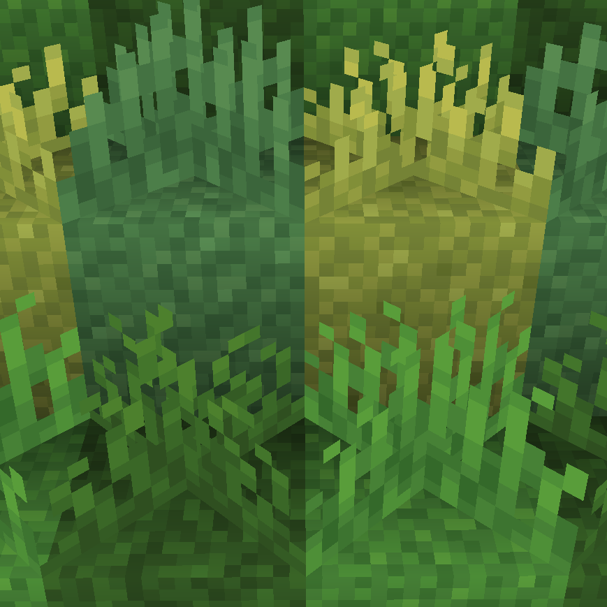
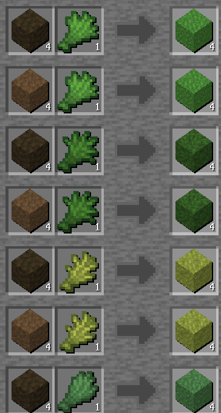

# Cubyz Grassy

Adds grass crafting recipes to Cubyz! I made this to learn addon creation (and also I really want grass blocks on ashframe)

Combine each ground and vegetation variant to produce its corresponding grass block.

## Installation

For singleplayer or when hosting a server, download the release zip and extract it in your assets folder. When joining a server, addons are automatically downloaded.
