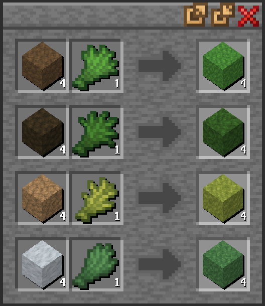

# Cubyz Grassy

Adds grass crafting recipes to Cubyz! I made this to learn addon creation (and also I really want grass blocks on ashframe)

Combine either mud or soil with any vegetation to produce its corresponding block.

## Installation

For singleplayer or when hosting a server, download the release zip and extract it in your assets folder. When joining a server, addons are automatically downloaded.
